# 用户行为分析


想要进行精细化运营，围绕的中心永远是用户。用户研究的常用方法有：情境调查、用户访谈、问卷调查、A/B测试、可用性测试与用户行为分析。其中用户行为分析是用户研究的最有效方法之一。
## 什么是用户行为分析
### 了解用户行为分析
用户行为分析是对用户在产品上的产生的行为及行为背后的数据进行分析，通过构建用户行为模型和用户画像，来改变产品决策，实现精细化运营，指导业务增长。

在产品运营过程中，对用户行为的数据进行收集、存储、跟踪、分析与应用等，可以找到实现用户自增长的病毒因素、群体特征与目标用户。从而深度还原用户使用场景、操作规律、访问路径及行为特点等。
### 用户行为分析的目的
对于互联网金融、新零售、供应链、在线教育、银行、证券等行业的产品而言，以数据为驱动的用户行为分析尤为重要。用户行为分析的目的是：推动产品迭代、实现精准营销，提供定制服务，驱动产品决策等。

主要体现在以下几个方面：
- 对产品而言，帮助验证产品的可行性，研究产品决策，清楚地了解用户的行为习惯，并找出产品的缺陷，以便需求的迭代与优化。
- 对设计而言，帮助增加体验的友好性，匹配用户情感，细腻地贴合用户的个性服务，并发现交互的不足，以便设计的完善与改进。
- 对运营而言，帮助裂变增长的有效性，实现精准营销，全面地挖掘用户的使用场景，并分析运营的问题，以便决策的转变与调整。

### 用户行为分析指标
对用户行为数据进行分析，关键是找到一个衡量数据的指标。根据用户行为表现，可以细分多个指标，主要分为三类：黏性指标、活跃指标和产出指标。

- 粘性指标：主要关注用户周期内持续访问的情况，比如新用户数与比例、活跃用户数与比例、用户转化率、用户留存率、用户流失率、用户访问率。
- 活跃指标：主要考察的是用户访问的参与度，比如活跃用户、新增用户、回访用户、流失用户、平均停留时长、使用频率等。
- 产出指标：主要衡量用户创造的直接价值输出，比如页面浏览数PV、独立访客数UV、点击次数、消费频次、消费金额等。

这些指标细分的目的是指导运营决策，即根据不同的指标去优化与调整运营策略。简而言之，用户行为分析指标细分的根本目的有：一是增加用户的粘性，提升用户的认知度；二是促进用户的活跃，诱导用户的参与度；三是提高用户的价值，培养用户的忠诚度。

### 实施用户行为分析
确定好用户行为分析指标后，我们可以借助一些模型对用户行为的数据进行定性和定量的分析。

常用的分析模型有：
- 行为事件分析
- 用户留存分析
- 漏斗模型分析
- 行为路径分析
- 福格模型分析

#### 行为事件分析
行为事件分析是根据运营关键指标对用户特定事件进行分析。通过追踪或记录用户行为事件，可以快速的了解到事件的趋势走向和用户的完成情况。

作用：主要是解决用户是谁，从哪里来，什么时候来，干了什么事情，如何做的，归纳总结即为事件的定义遵循5W原则：Who、When、Where、What、How。主要用于研究某行为事件的发生对企业组织价值的影响以及影响程度。


#### 用户留存分析
用户留存分析是一种用来分析用户参与情况与活跃程度的模型。通过留存量和留存率，可以了解用户的留存和流失状况。比如用次日留存、周留存、月留存等指标来衡量产品的人气或粘度。

作用：

用户留存一般符合40-20-10法则，即新用户的次日留存应该大于40%，周留存大于20%，月留存大于10%才符合业务标准。我们做用户留存分析主要验证是否达到既定的运营目标，进而影响下一步的产品决策。

#### 漏斗模型分析
漏斗模型分析是用户在使用产品过程中，描述各个阶段中关键环节的用户转化和流失率情况。比如在日常活动运营中，通过确定各个环节的流失率，分析用户怎么流失、为什么流失、在哪里流失。找到需要改进的环节，要重点关注，并采取有效的措施来提升整体转化率。

作用：

漏斗模型分析可以验证整个流程的设计是否合理。通过对各环节相关转化率的比较，可以发现运营活动中哪些环节的转化率没有达到预期指标，从而发现问题所在，并找到优化方向。

#### 行为路径分析
行为路径分析就是分析用户在产品使用过程中的访问路径。通过对行为路径的数据分析，可以发现用户最常用的功能和使用路径。并从页面的多维度分析，追踪用户转化路径，提升产品用户体验。
不管是产品冷启动，还是日常活动营销，做行为路径分析首先要梳理用户行为轨迹。用户行为轨迹包括认知、熟悉、试用、使用到忠诚等。轨迹背后反映的是用户特征，这些特征对产品运营有重要的参考价值。

在分析用户行为路径时，我们会发现用户实际的行为路径与期望的行为路径有一定的偏差。这个偏差就是产品可能存在的问题，需要及时对产品进行优化，找到缩短路径的空间。

#### 福格模型分析
福格行为模型是用来研究用户行为原因的分析模型。福格行为模型用公式来简化就是B=MAT，即B=MAT。B代表行为，M代表动机，A代表能力，T代表触发。它认为要让一个行为发生，必须同时具备三个元素：动机、能力和触发器。因此可以借助福格行为模型来评估产品的合理性和能否达到预期目标。


### AISAS模型
用户行为分析模型其实也是一种AISAS模型：Attention注意、Interest兴趣、Search搜索、Action行动、Share分享，也影响了用户行为决策。
- Attention
Attention是指我们要想获得一定的业绩，就要首先吸引客户的注意。如果没有客户的话，那后面的一切营销活动都会没有任何用武之地。想要吸引客户的注意，我们可以从多方面来下手，比如说通过互动营销这种办法来吸引到店消费。
- Interest
吸引住了客户之后，我们要想真正的留住这些客户，就要让客户对我们的产品产生一定的兴趣，让他们发自内心的想要购买我们的产品。这就要求我们在事先要对目标群体进行一定的市场调查，了解目标群体的痒点。
- Search
当目标群体对我们产生一定的兴趣之后，他们可能就会通过一些线上或者线下的渠道来搜集我们产品的信息，这个阶段就是搜索阶段。如果要想使客户对我们留下较好的印象，线上要注意搜索引擎优化，线下要做到优化服务、提升口碑。

- Action
如果客户经过一系列的调查之后对公司的产品较为满意的话，就会直接进行消费。在这个阶段里面促进订单成交的最主要的环节便是销售环节，所以会对销售能力有着较高的要求。
- Share
如果客户使用该企业的产品获得了较好的使用感受，他可能会和周围的人进行分享，向周围的人推荐该企业的产品，这也就是所谓的口碑传播。我们一定要重视口碑传播的重要作用，它的说服力能够秒杀一切营销活动。


## 数据集描述

 | 字段 | 描述 |
 | ------------ |:-------:| 
 | user_id  | 用户ID |
 | item_id  | 商品ID  |
 | behavior_type  | 用户行为类别 |
 | user_geohash  | 用户地理位置 |
 | item_category  | 商品所属品类 |
 | time  | 用户行为发生的时间 |
 
 其中，用户行为类别包含点击、收藏、加购物车、支付四种类别，分别用数字1，2，3，4表示

## 明确分析目的
基于淘宝app平台数据，通过相关指标对用户行为进行分析，推动产品迭代、实现精准营销，提供定制服务，驱动产品决策等。

### 获得相关指标：
1. 总量
2. 日pv
3. 日uv

### 用户消费行为分析
4. 付费率
5. 复购率

### 通过漏斗模型进行用户行为分析

### RFM模型分析用户价值


## 理解数据


```python
# 导入相关库
import numpy as np
import pandas as pd
import matplotlib.pyplot as plt
import seaborn as sns
import plotly as py
import plotly.graph_objects as go
import csv
import os

pyplot = py.offline.plot

os.getcwd()
```


```python
import warnings
plt.rcParams["font.family"] = "SimHei"
plt.rcParams["axes.unicode_minus"] = False
plt.rcParams.update({"font.size":15})
plt.style.use("seaborn-darkgrid")

warnings.filterwarnings("ignore")
```


```python
os.chdir(r"F:\DataSets\user_behavior_data_on_taobao_app")

# 数据读入
dt = pd.read_csv("./tianchi_mobile_recommend_train_user.csv", dtype=str)
```


```python
# 查看数据情况
dt.shape
```


    (12256906, 6)


```python
dt.columns
```


    Index(['user_id', 'item_id', 'behavior_type', 'user_geohash', 'item_category',
           'time'],
          dtype='object')


```python
dt.sample(5)
```


<div>
<style scoped>
    .dataframe tbody tr th:only-of-type {
        vertical-align: middle;
    }

    .dataframe tbody tr th {
        vertical-align: top;
    }

    .dataframe thead th {
        text-align: right;
    }
</style>
<table border="1" class="dataframe">
  <thead>
    <tr style="text-align: right;">
      <th></th>
      <th>user_id</th>
      <th>item_id</th>
      <th>behavior_type</th>
      <th>user_geohash</th>
      <th>item_category</th>
      <th>time</th>
    </tr>
  </thead>
  <tbody>
    <tr>
      <th>1658950</th>
      <td>5838287</td>
      <td>11664497</td>
      <td>1</td>
      <td>9q9mas6</td>
      <td>13713</td>
      <td>2014-12-06 15</td>
    </tr>
    <tr>
      <th>12147758</th>
      <td>27068656</td>
      <td>215433552</td>
      <td>1</td>
      <td>NaN</td>
      <td>4625</td>
      <td>2014-11-25 00</td>
    </tr>
    <tr>
      <th>5986570</th>
      <td>22060610</td>
      <td>239655940</td>
      <td>1</td>
      <td>NaN</td>
      <td>769</td>
      <td>2014-12-08 11</td>
    </tr>
    <tr>
      <th>5004260</th>
      <td>127909205</td>
      <td>142480396</td>
      <td>1</td>
      <td>NaN</td>
      <td>6130</td>
      <td>2014-12-15 22</td>
    </tr>
    <tr>
      <th>7838152</th>
      <td>37357777</td>
      <td>253737813</td>
      <td>1</td>
      <td>NaN</td>
      <td>3035</td>
      <td>2014-12-04 19</td>
    </tr>
  </tbody>
</table>
</div>


## 数据清洗

### 缺失值处理
#### 统计缺失值

统计缺失率


```python
# 统计缺失率
dt.apply(lambda x: sum(x.isnull()) / len(x), axis=0)
```


    user_id          0.00000
    item_id          0.00000
    behavior_type    0.00000
    user_geohash     0.68001
    item_category    0.00000
    time             0.00000
    dtype: float64


```python
dt.user_geohash.isnull().sum()
```


    8334824


从统计结果得知，存在缺失值的字段为user_geohash，缺失率为0.68001,共缺失8334824条，暂不做处理

### 日期时间数据处理
从抽样的5份数据看出，time字段包含日期及小时，这儿对日期与小时作拆分


```python
# 拆分time
dt["date"] = dt["time"].str[0:10].str.strip()
dt["hour"] = dt["time"].str[11:].str.strip()
dt.sample()
```


<div>
<style scoped>
    .dataframe tbody tr th:only-of-type {
        vertical-align: middle;
    }

    .dataframe tbody tr th {
        vertical-align: top;
    }

    .dataframe thead th {
        text-align: right;
    }
</style>
<table border="1" class="dataframe">
  <thead>
    <tr style="text-align: right;">
      <th></th>
      <th>user_id</th>
      <th>item_id</th>
      <th>behavior_type</th>
      <th>user_geohash</th>
      <th>item_category</th>
      <th>time</th>
      <th>date</th>
      <th>hour</th>
    </tr>
  </thead>
  <tbody>
    <tr>
      <th>8914805</th>
      <td>8909639</td>
      <td>56156672</td>
      <td>1</td>
      <td>95qoom0</td>
      <td>12189</td>
      <td>2014-12-11 14</td>
      <td>2014-12-11</td>
      <td>14</td>
    </tr>
  </tbody>
</table>
</div>


### 更改数据类型


```python
# 查看数据类型
dt.info()
# dt.dtypes
```

    <class 'pandas.core.frame.DataFrame'>
    RangeIndex: 12256906 entries, 0 to 12256905
    Data columns (total 8 columns):
    user_id          object
    item_id          object
    behavior_type    object
    user_geohash     object
    item_category    object
    time             object
    date             object
    hour             object
    dtypes: object(8)
    memory usage: 748.1+ MB
    

更改time、date为日期型数据，hour为int型数据


```python
# 更改time、date为日期型数据，hour为int型数据
dt["date"] = pd.to_datetime(dt["date"])
dt["time"] = pd.to_datetime(dt["time"])
dt["hour"] = dt["hour"].astype("int")
```


```python
dt.info()
```

    <class 'pandas.core.frame.DataFrame'>
    RangeIndex: 12256906 entries, 0 to 12256905
    Data columns (total 8 columns):
    user_id          object
    item_id          object
    behavior_type    object
    user_geohash     object
    item_category    object
    time             datetime64[ns]
    date             datetime64[ns]
    hour             int32
    dtypes: datetime64[ns](2), int32(1), object(5)
    memory usage: 701.3+ MB
    

###  异常值处理


```python
dt.sort_values(by="time", ascending=True, inplace=True)
dt.reset_index(drop=True, inplace=True)
dt.describe(include="all")
```


<div>
<style scoped>
    .dataframe tbody tr th:only-of-type {
        vertical-align: middle;
    }

    .dataframe tbody tr th {
        vertical-align: top;
    }

    .dataframe thead th {
        text-align: right;
    }
</style>
<table border="1" class="dataframe">
  <thead>
    <tr style="text-align: right;">
      <th></th>
      <th>user_id</th>
      <th>item_id</th>
      <th>behavior_type</th>
      <th>user_geohash</th>
      <th>item_category</th>
      <th>time</th>
      <th>date</th>
      <th>hour</th>
    </tr>
  </thead>
  <tbody>
    <tr>
      <th>count</th>
      <td>12256906</td>
      <td>12256906</td>
      <td>12256906</td>
      <td>3922082</td>
      <td>12256906</td>
      <td>12256906</td>
      <td>12256906</td>
      <td>1.225691e+07</td>
    </tr>
    <tr>
      <th>unique</th>
      <td>10000</td>
      <td>2876947</td>
      <td>4</td>
      <td>575458</td>
      <td>8916</td>
      <td>744</td>
      <td>31</td>
      <td>NaN</td>
    </tr>
    <tr>
      <th>top</th>
      <td>36233277</td>
      <td>112921337</td>
      <td>1</td>
      <td>94ek6ke</td>
      <td>1863</td>
      <td>2014-12-11 22:00:00</td>
      <td>2014-12-12 00:00:00</td>
      <td>NaN</td>
    </tr>
    <tr>
      <th>freq</th>
      <td>31030</td>
      <td>1445</td>
      <td>11550581</td>
      <td>1052</td>
      <td>393247</td>
      <td>54797</td>
      <td>691712</td>
      <td>NaN</td>
    </tr>
    <tr>
      <th>first</th>
      <td>NaN</td>
      <td>NaN</td>
      <td>NaN</td>
      <td>NaN</td>
      <td>NaN</td>
      <td>2014-11-18 00:00:00</td>
      <td>2014-11-18 00:00:00</td>
      <td>NaN</td>
    </tr>
    <tr>
      <th>last</th>
      <td>NaN</td>
      <td>NaN</td>
      <td>NaN</td>
      <td>NaN</td>
      <td>NaN</td>
      <td>2014-12-18 23:00:00</td>
      <td>2014-12-18 00:00:00</td>
      <td>NaN</td>
    </tr>
    <tr>
      <th>mean</th>
      <td>NaN</td>
      <td>NaN</td>
      <td>NaN</td>
      <td>NaN</td>
      <td>NaN</td>
      <td>NaN</td>
      <td>NaN</td>
      <td>1.481799e+01</td>
    </tr>
    <tr>
      <th>std</th>
      <td>NaN</td>
      <td>NaN</td>
      <td>NaN</td>
      <td>NaN</td>
      <td>NaN</td>
      <td>NaN</td>
      <td>NaN</td>
      <td>6.474778e+00</td>
    </tr>
    <tr>
      <th>min</th>
      <td>NaN</td>
      <td>NaN</td>
      <td>NaN</td>
      <td>NaN</td>
      <td>NaN</td>
      <td>NaN</td>
      <td>NaN</td>
      <td>0.000000e+00</td>
    </tr>
    <tr>
      <th>25%</th>
      <td>NaN</td>
      <td>NaN</td>
      <td>NaN</td>
      <td>NaN</td>
      <td>NaN</td>
      <td>NaN</td>
      <td>NaN</td>
      <td>1.000000e+01</td>
    </tr>
    <tr>
      <th>50%</th>
      <td>NaN</td>
      <td>NaN</td>
      <td>NaN</td>
      <td>NaN</td>
      <td>NaN</td>
      <td>NaN</td>
      <td>NaN</td>
      <td>1.600000e+01</td>
    </tr>
    <tr>
      <th>75%</th>
      <td>NaN</td>
      <td>NaN</td>
      <td>NaN</td>
      <td>NaN</td>
      <td>NaN</td>
      <td>NaN</td>
      <td>NaN</td>
      <td>2.000000e+01</td>
    </tr>
    <tr>
      <th>max</th>
      <td>NaN</td>
      <td>NaN</td>
      <td>NaN</td>
      <td>NaN</td>
      <td>NaN</td>
      <td>NaN</td>
      <td>NaN</td>
      <td>2.300000e+01</td>
    </tr>
  </tbody>
</table>
</div>


观察知并无异常数据

## 数据分析

### 总量


```python
# 用户总量
totle_num = dt["user_id"].drop_duplicates().count()
```


```python
totle_num
```


    10000


### pv、uv分析
- pv（访问量）：PageView 
- uv（访客量）：UniqueVisitor

#### 日访问分析

日pv ： 记录每天用户访问次数


```python
# 日pv ： 记录每天用户访问次数
pv_d = dt.groupby("date").count()["user_id"]
```


```python
pv_d.name="pv_d"
pv_d
```


    date
    2014-11-18    366701
    2014-11-19    358823
    2014-11-20    353429
    2014-11-21    333104
    2014-11-22    361355
    2014-11-23    382702
    2014-11-24    378342
    2014-11-25    370239
    2014-11-26    360896
    2014-11-27    371384
    2014-11-28    340638
    2014-11-29    364697
    2014-11-30    401620
    2014-12-01    394611
    2014-12-02    405216
    2014-12-03    411606
    2014-12-04    399952
    2014-12-05    361878
    2014-12-06    389610
    2014-12-07    399751
    2014-12-08    386667
    2014-12-09    398025
    2014-12-10    421910
    2014-12-11    488508
    2014-12-12    691712
    2014-12-13    407160
    2014-12-14    402541
    2014-12-15    398356
    2014-12-16    395085
    2014-12-17    384791
    2014-12-18    375597
    Name: pv_d, dtype: int64


```python
pv_d.index.name
```


    'date'


日uv : 记录每日上线的用户数


```python
# 日uv : 记录每日上线的用户数
uv_d = dt.groupby('date')["user_id"].apply(
    lambda x: x.drop_duplicates().count())
```


```python
uv_d.name = "uv_d"
uv_d
```


    date
    2014-11-18    6343
    2014-11-19    6420
    2014-11-20    6333
    2014-11-21    6276
    2014-11-22    6187
    2014-11-23    6373
    2014-11-24    6513
    2014-11-25    6351
    2014-11-26    6357
    2014-11-27    6359
    2014-11-28    6189
    2014-11-29    6224
    2014-11-30    6379
    2014-12-01    6544
    2014-12-02    6550
    2014-12-03    6585
    2014-12-04    6531
    2014-12-05    6367
    2014-12-06    6440
    2014-12-07    6422
    2014-12-08    6564
    2014-12-09    6566
    2014-12-10    6652
    2014-12-11    6894
    2014-12-12    7720
    2014-12-13    6776
    2014-12-14    6668
    2014-12-15    6787
    2014-12-16    6729
    2014-12-17    6643
    2014-12-18    6582
    Name: uv_d, dtype: int64


合并uv_d与pv_d


```python
# 合并uv_d与pv_d
pv_uv_d = pd.concat([pv_d, uv_d], axis=1)
```


```python
pv_uv_d.head()
```


<div>
<style scoped>
    .dataframe tbody tr th:only-of-type {
        vertical-align: middle;
    }

    .dataframe tbody tr th {
        vertical-align: top;
    }

    .dataframe thead th {
        text-align: right;
    }
</style>
<table border="1" class="dataframe">
  <thead>
    <tr style="text-align: right;">
      <th></th>
      <th>pv_d</th>
      <th>uv_d</th>
    </tr>
    <tr>
      <th>date</th>
      <th></th>
      <th></th>
    </tr>
  </thead>
  <tbody>
    <tr>
      <th>2014-11-18</th>
      <td>366701</td>
      <td>6343</td>
    </tr>
    <tr>
      <th>2014-11-19</th>
      <td>358823</td>
      <td>6420</td>
    </tr>
    <tr>
      <th>2014-11-20</th>
      <td>353429</td>
      <td>6333</td>
    </tr>
    <tr>
      <th>2014-11-21</th>
      <td>333104</td>
      <td>6276</td>
    </tr>
    <tr>
      <th>2014-11-22</th>
      <td>361355</td>
      <td>6187</td>
    </tr>
  </tbody>
</table>
</div>


```python
# 查看pv_d与uv_d间的相关系数
method = ["pearson", "spearman"]
for i in method:
    corr = pv_uv_d.corr(method=i)
    print(f"{i}相关系数：{corr.iloc[0,1]:.3f}")
```

    pearson相关系数：0.921
    spearman相关系数：0.825
    

访问量与访问用户间的pearson相关系数为0.921、spearman相关系数为0.825，表现为强相关性


```python
plt.rcParams["font.family"] = "SimHei"
plt.figure(figsize=(16, 9))
plt.subplot(211)
plt.plot(pv_d,c="m",label="pv")
plt.legend()
plt.subplot(212)
plt.plot(uv_d, c="c",label="uv")
plt.legend()
plt.suptitle("PV与UV变化趋势", size=25)

plt.show()
```


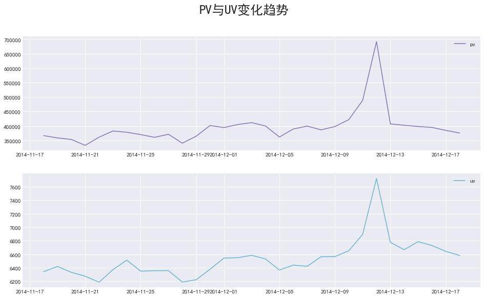


通过图形我们很容易发现双十二期间，pv与uv同时到达峰值

#### 小时访问分析


```python
# pv_h 记录每天中各小时访问次数
pv_h = dt.groupby(["date","hour"]).count()["user_id"]
```


```python
pv_h.name = "pv_h"
```


```python
pv_h.head()
```


    date        hour
    2014-11-18  0       13719
                1        7194
                2        5343
                3        3486
                4        2782
    Name: pv_h, dtype: int64


uv_h 记录每天中各小时访问用户数


```python
# uv_h 记录每天中各小时访问用户数
uv_h = dt.groupby(["date", "hour"])["user_id"].apply(lambda x: x.drop_duplicates().count())
```


```python
uv_h.name = "uv_h"
uv_h.sample(5)
```


    date        hour
    2014-12-06  18      1128
    2014-12-17  21      1643
    2014-12-12  13      1832
    2014-12-05  2        144
    2014-12-03  21      1668
    Name: uv_h, dtype: int64


合并uv_h与pv_h


```python
# 合并uv_h与pv_h
pv_uv_h = pd.concat([pv_h, uv_h], axis=1)
pv_uv_h.sample(5)
```


<div>
<style scoped>
    .dataframe tbody tr th:only-of-type {
        vertical-align: middle;
    }

    .dataframe tbody tr th {
        vertical-align: top;
    }

    .dataframe thead th {
        text-align: right;
    }
</style>
<table border="1" class="dataframe">
  <thead>
    <tr style="text-align: right;">
      <th></th>
      <th></th>
      <th>pv_h</th>
      <th>uv_h</th>
    </tr>
    <tr>
      <th>date</th>
      <th>hour</th>
      <th></th>
      <th></th>
    </tr>
  </thead>
  <tbody>
    <tr>
      <th>2014-12-13</th>
      <th>21</th>
      <td>35747</td>
      <td>1687</td>
    </tr>
    <tr>
      <th>2014-12-16</th>
      <th>22</th>
      <td>36746</td>
      <td>1571</td>
    </tr>
    <tr>
      <th>2014-12-09</th>
      <th>20</th>
      <td>32912</td>
      <td>1577</td>
    </tr>
    <tr>
      <th>2014-11-27</th>
      <th>20</th>
      <td>26178</td>
      <td>1397</td>
    </tr>
    <tr>
      <th>2014-12-14</th>
      <th>17</th>
      <td>17307</td>
      <td>1145</td>
    </tr>
  </tbody>
</table>
</div>


```python
pd.MultiIndex.to_frame(pv_h.index)
```


<div>
<style scoped>
    .dataframe tbody tr th:only-of-type {
        vertical-align: middle;
    }

    .dataframe tbody tr th {
        vertical-align: top;
    }

    .dataframe thead th {
        text-align: right;
    }
</style>
<table border="1" class="dataframe">
  <thead>
    <tr style="text-align: right;">
      <th></th>
      <th></th>
      <th>date</th>
      <th>hour</th>
    </tr>
    <tr>
      <th>date</th>
      <th>hour</th>
      <th></th>
      <th></th>
    </tr>
  </thead>
  <tbody>
    <tr>
      <th rowspan="24" valign="top">2014-11-18</th>
      <th>0</th>
      <td>2014-11-18</td>
      <td>0</td>
    </tr>
    <tr>
      <th>1</th>
      <td>2014-11-18</td>
      <td>1</td>
    </tr>
    <tr>
      <th>2</th>
      <td>2014-11-18</td>
      <td>2</td>
    </tr>
    <tr>
      <th>3</th>
      <td>2014-11-18</td>
      <td>3</td>
    </tr>
    <tr>
      <th>4</th>
      <td>2014-11-18</td>
      <td>4</td>
    </tr>
    <tr>
      <th>5</th>
      <td>2014-11-18</td>
      <td>5</td>
    </tr>
    <tr>
      <th>6</th>
      <td>2014-11-18</td>
      <td>6</td>
    </tr>
    <tr>
      <th>7</th>
      <td>2014-11-18</td>
      <td>7</td>
    </tr>
    <tr>
      <th>8</th>
      <td>2014-11-18</td>
      <td>8</td>
    </tr>
    <tr>
      <th>9</th>
      <td>2014-11-18</td>
      <td>9</td>
    </tr>
    <tr>
      <th>10</th>
      <td>2014-11-18</td>
      <td>10</td>
    </tr>
    <tr>
      <th>11</th>
      <td>2014-11-18</td>
      <td>11</td>
    </tr>
    <tr>
      <th>12</th>
      <td>2014-11-18</td>
      <td>12</td>
    </tr>
    <tr>
      <th>13</th>
      <td>2014-11-18</td>
      <td>13</td>
    </tr>
    <tr>
      <th>14</th>
      <td>2014-11-18</td>
      <td>14</td>
    </tr>
    <tr>
      <th>15</th>
      <td>2014-11-18</td>
      <td>15</td>
    </tr>
    <tr>
      <th>16</th>
      <td>2014-11-18</td>
      <td>16</td>
    </tr>
    <tr>
      <th>17</th>
      <td>2014-11-18</td>
      <td>17</td>
    </tr>
    <tr>
      <th>18</th>
      <td>2014-11-18</td>
      <td>18</td>
    </tr>
    <tr>
      <th>19</th>
      <td>2014-11-18</td>
      <td>19</td>
    </tr>
    <tr>
      <th>20</th>
      <td>2014-11-18</td>
      <td>20</td>
    </tr>
    <tr>
      <th>21</th>
      <td>2014-11-18</td>
      <td>21</td>
    </tr>
    <tr>
      <th>22</th>
      <td>2014-11-18</td>
      <td>22</td>
    </tr>
    <tr>
      <th>23</th>
      <td>2014-11-18</td>
      <td>23</td>
    </tr>
    <tr>
      <th rowspan="6" valign="top">2014-11-19</th>
      <th>0</th>
      <td>2014-11-19</td>
      <td>0</td>
    </tr>
    <tr>
      <th>1</th>
      <td>2014-11-19</td>
      <td>1</td>
    </tr>
    <tr>
      <th>2</th>
      <td>2014-11-19</td>
      <td>2</td>
    </tr>
    <tr>
      <th>3</th>
      <td>2014-11-19</td>
      <td>3</td>
    </tr>
    <tr>
      <th>4</th>
      <td>2014-11-19</td>
      <td>4</td>
    </tr>
    <tr>
      <th>5</th>
      <td>2014-11-19</td>
      <td>5</td>
    </tr>
    <tr>
      <th>...</th>
      <th>...</th>
      <td>...</td>
      <td>...</td>
    </tr>
    <tr>
      <th rowspan="6" valign="top">2014-12-17</th>
      <th>18</th>
      <td>2014-12-17</td>
      <td>18</td>
    </tr>
    <tr>
      <th>19</th>
      <td>2014-12-17</td>
      <td>19</td>
    </tr>
    <tr>
      <th>20</th>
      <td>2014-12-17</td>
      <td>20</td>
    </tr>
    <tr>
      <th>21</th>
      <td>2014-12-17</td>
      <td>21</td>
    </tr>
    <tr>
      <th>22</th>
      <td>2014-12-17</td>
      <td>22</td>
    </tr>
    <tr>
      <th>23</th>
      <td>2014-12-17</td>
      <td>23</td>
    </tr>
    <tr>
      <th rowspan="24" valign="top">2014-12-18</th>
      <th>0</th>
      <td>2014-12-18</td>
      <td>0</td>
    </tr>
    <tr>
      <th>1</th>
      <td>2014-12-18</td>
      <td>1</td>
    </tr>
    <tr>
      <th>2</th>
      <td>2014-12-18</td>
      <td>2</td>
    </tr>
    <tr>
      <th>3</th>
      <td>2014-12-18</td>
      <td>3</td>
    </tr>
    <tr>
      <th>4</th>
      <td>2014-12-18</td>
      <td>4</td>
    </tr>
    <tr>
      <th>5</th>
      <td>2014-12-18</td>
      <td>5</td>
    </tr>
    <tr>
      <th>6</th>
      <td>2014-12-18</td>
      <td>6</td>
    </tr>
    <tr>
      <th>7</th>
      <td>2014-12-18</td>
      <td>7</td>
    </tr>
    <tr>
      <th>8</th>
      <td>2014-12-18</td>
      <td>8</td>
    </tr>
    <tr>
      <th>9</th>
      <td>2014-12-18</td>
      <td>9</td>
    </tr>
    <tr>
      <th>10</th>
      <td>2014-12-18</td>
      <td>10</td>
    </tr>
    <tr>
      <th>11</th>
      <td>2014-12-18</td>
      <td>11</td>
    </tr>
    <tr>
      <th>12</th>
      <td>2014-12-18</td>
      <td>12</td>
    </tr>
    <tr>
      <th>13</th>
      <td>2014-12-18</td>
      <td>13</td>
    </tr>
    <tr>
      <th>14</th>
      <td>2014-12-18</td>
      <td>14</td>
    </tr>
    <tr>
      <th>15</th>
      <td>2014-12-18</td>
      <td>15</td>
    </tr>
    <tr>
      <th>16</th>
      <td>2014-12-18</td>
      <td>16</td>
    </tr>
    <tr>
      <th>17</th>
      <td>2014-12-18</td>
      <td>17</td>
    </tr>
    <tr>
      <th>18</th>
      <td>2014-12-18</td>
      <td>18</td>
    </tr>
    <tr>
      <th>19</th>
      <td>2014-12-18</td>
      <td>19</td>
    </tr>
    <tr>
      <th>20</th>
      <td>2014-12-18</td>
      <td>20</td>
    </tr>
    <tr>
      <th>21</th>
      <td>2014-12-18</td>
      <td>21</td>
    </tr>
    <tr>
      <th>22</th>
      <td>2014-12-18</td>
      <td>22</td>
    </tr>
    <tr>
      <th>23</th>
      <td>2014-12-18</td>
      <td>23</td>
    </tr>
  </tbody>
</table>
<p>744 rows × 2 columns</p>
</div>


```python
# 查看pv_h与uv_h间的相关系数
method = ["pearson", "spearman"]
for i in method:
    corr = pv_uv_h.corr(method=i)
    print(f"{i}相关系数：{corr.iloc[0,1]:.3f}")
```

    pearson相关系数：0.929
    spearman相关系数：0.943
    

访问量与访问用户间的pearson相关系数为0.929、spearman相关系数为0.943，表现出极强的相关性

对某天不同时间的pv，uv变化趋势进行可视化


```python
# 对某天不同时间的pv，uv变化趋势进行可视化
# 以2014-12-12为例
plt.figure(figsize=(16, 9))
plt.subplot(211)
plt.plot(pv_h.loc["2014-12-09"].values.tolist(), lw=3, label="每小时访问量")
plt.xticks(range(0, 24))
plt.legend(loc=2)
plt.subplot(212)
plt.plot(uv_h.loc["2014-12-09"].values.tolist(), c="c", lw=3, label="每小时访问客户数")
plt.suptitle("PV与UV变化趋势", size=22)
plt.xticks(range(0, 24))
plt.legend(loc=2)
plt.show()
```


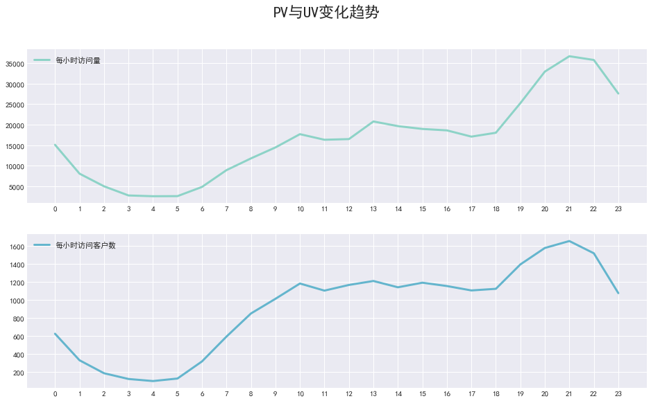


PV与UV呈相同的变化趋势，0-5点呈下降趋势，5-10逐渐增长，21时附近达到峰值，18点-0点为淘宝app用户活跃时间段

### 不同行为类型用户PV分析

计算不同行为的用户，在每小时的访问量


```python
# 计算不同行为的用户，在每小时的访问量
d_pv_h = pd.pivot_table(columns="behavior_type",
                        index=["hour"],
                        data=dt,
                        values="user_id",
                        aggfunc=np.size)
```


```python
d_pv_h.sample(10)
```


<div>
<style scoped>
    .dataframe tbody tr th:only-of-type {
        vertical-align: middle;
    }

    .dataframe tbody tr th {
        vertical-align: top;
    }

    .dataframe thead th {
        text-align: right;
    }
</style>
<table border="1" class="dataframe">
  <thead>
    <tr style="text-align: right;">
      <th>behavior_type</th>
      <th>1</th>
      <th>2</th>
      <th>3</th>
      <th>4</th>
    </tr>
    <tr>
      <th>hour</th>
      <th></th>
      <th></th>
      <th></th>
      <th></th>
    </tr>
  </thead>
  <tbody>
    <tr>
      <th>15</th>
      <td>562238</td>
      <td>12010</td>
      <td>17289</td>
      <td>7312</td>
    </tr>
    <tr>
      <th>1</th>
      <td>252991</td>
      <td>6276</td>
      <td>6712</td>
      <td>1703</td>
    </tr>
    <tr>
      <th>8</th>
      <td>374701</td>
      <td>7849</td>
      <td>9970</td>
      <td>3586</td>
    </tr>
    <tr>
      <th>13</th>
      <td>561513</td>
      <td>11694</td>
      <td>17419</td>
      <td>7717</td>
    </tr>
    <tr>
      <th>14</th>
      <td>558246</td>
      <td>11695</td>
      <td>17067</td>
      <td>7207</td>
    </tr>
    <tr>
      <th>0</th>
      <td>487341</td>
      <td>11062</td>
      <td>14156</td>
      <td>4845</td>
    </tr>
    <tr>
      <th>17</th>
      <td>476369</td>
      <td>9754</td>
      <td>14515</td>
      <td>5298</td>
    </tr>
    <tr>
      <th>10</th>
      <td>515960</td>
      <td>11185</td>
      <td>16203</td>
      <td>7317</td>
    </tr>
    <tr>
      <th>2</th>
      <td>139139</td>
      <td>3311</td>
      <td>3834</td>
      <td>806</td>
    </tr>
    <tr>
      <th>9</th>
      <td>456781</td>
      <td>10507</td>
      <td>12956</td>
      <td>5707</td>
    </tr>
  </tbody>
</table>
</div>


```python
d_pv_h.rename(columns={"1": "点击", "2": "收藏", "3": "加购物车", "4": "支付"})
```


<div>
<style scoped>
    .dataframe tbody tr th:only-of-type {
        vertical-align: middle;
    }

    .dataframe tbody tr th {
        vertical-align: top;
    }

    .dataframe thead th {
        text-align: right;
    }
</style>
<table border="1" class="dataframe">
  <thead>
    <tr style="text-align: right;">
      <th>behavior_type</th>
      <th>点击</th>
      <th>收藏</th>
      <th>加购物车</th>
      <th>支付</th>
    </tr>
    <tr>
      <th>hour</th>
      <th></th>
      <th></th>
      <th></th>
      <th></th>
    </tr>
  </thead>
  <tbody>
    <tr>
      <th>0</th>
      <td>487341</td>
      <td>11062</td>
      <td>14156</td>
      <td>4845</td>
    </tr>
    <tr>
      <th>1</th>
      <td>252991</td>
      <td>6276</td>
      <td>6712</td>
      <td>1703</td>
    </tr>
    <tr>
      <th>2</th>
      <td>139139</td>
      <td>3311</td>
      <td>3834</td>
      <td>806</td>
    </tr>
    <tr>
      <th>3</th>
      <td>93250</td>
      <td>2282</td>
      <td>2480</td>
      <td>504</td>
    </tr>
    <tr>
      <th>4</th>
      <td>75832</td>
      <td>2010</td>
      <td>2248</td>
      <td>397</td>
    </tr>
    <tr>
      <th>5</th>
      <td>83545</td>
      <td>2062</td>
      <td>2213</td>
      <td>476</td>
    </tr>
    <tr>
      <th>6</th>
      <td>150356</td>
      <td>3651</td>
      <td>3768</td>
      <td>1023</td>
    </tr>
    <tr>
      <th>7</th>
      <td>272470</td>
      <td>5885</td>
      <td>7044</td>
      <td>1938</td>
    </tr>
    <tr>
      <th>8</th>
      <td>374701</td>
      <td>7849</td>
      <td>9970</td>
      <td>3586</td>
    </tr>
    <tr>
      <th>9</th>
      <td>456781</td>
      <td>10507</td>
      <td>12956</td>
      <td>5707</td>
    </tr>
    <tr>
      <th>10</th>
      <td>515960</td>
      <td>11185</td>
      <td>16203</td>
      <td>7317</td>
    </tr>
    <tr>
      <th>11</th>
      <td>493679</td>
      <td>10918</td>
      <td>15257</td>
      <td>7086</td>
    </tr>
    <tr>
      <th>12</th>
      <td>500036</td>
      <td>9940</td>
      <td>15025</td>
      <td>6956</td>
    </tr>
    <tr>
      <th>13</th>
      <td>561513</td>
      <td>11694</td>
      <td>17419</td>
      <td>7717</td>
    </tr>
    <tr>
      <th>14</th>
      <td>558246</td>
      <td>11695</td>
      <td>17067</td>
      <td>7207</td>
    </tr>
    <tr>
      <th>15</th>
      <td>562238</td>
      <td>12010</td>
      <td>17289</td>
      <td>7312</td>
    </tr>
    <tr>
      <th>16</th>
      <td>541846</td>
      <td>11127</td>
      <td>16304</td>
      <td>6930</td>
    </tr>
    <tr>
      <th>17</th>
      <td>476369</td>
      <td>9754</td>
      <td>14515</td>
      <td>5298</td>
    </tr>
    <tr>
      <th>18</th>
      <td>517078</td>
      <td>10342</td>
      <td>14823</td>
      <td>5140</td>
    </tr>
    <tr>
      <th>19</th>
      <td>696035</td>
      <td>13952</td>
      <td>18853</td>
      <td>6352</td>
    </tr>
    <tr>
      <th>20</th>
      <td>885669</td>
      <td>16599</td>
      <td>25021</td>
      <td>7872</td>
    </tr>
    <tr>
      <th>21</th>
      <td>1030483</td>
      <td>20397</td>
      <td>30469</td>
      <td>8829</td>
    </tr>
    <tr>
      <th>22</th>
      <td>1027269</td>
      <td>20343</td>
      <td>32504</td>
      <td>8845</td>
    </tr>
    <tr>
      <th>23</th>
      <td>797754</td>
      <td>17705</td>
      <td>27434</td>
      <td>6359</td>
    </tr>
  </tbody>
</table>
</div>


```python
plt.figure(figsize=(10, 4))
sns.lineplot(data=d_pv_h, lw=3)
plt.show()
```


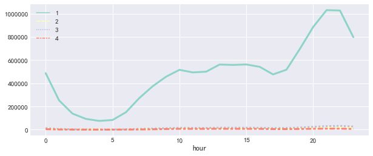


```python
plt.figure(figsize=(10, 4))
sns.lineplot(data=d_pv_h.iloc[:, 1:], lw=3)
plt.show()
```


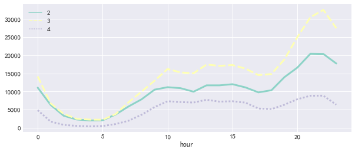


用户行为类别1，2，3，4分别表示点击、收藏、加购物车、支付

我们可以发现四种用户行为的波动情况基本一致，加购物车的数量高于收藏数

计算各类行为间的流失率


```python
# 计算各类行为间的流失率
d_pv_h["1-2流失率"] = (d_pv_h.iloc[:, 0] - d_pv_h.iloc[:, 1]) / d_pv_h.iloc[:, 0]
d_pv_h["1-3流失率"] = (d_pv_h.iloc[:, 0] - d_pv_h.iloc[:, 2]) / d_pv_h.iloc[:, 0]
d_pv_h["2-4流失率"] = (d_pv_h.iloc[:, 1] - d_pv_h.iloc[:, 3]) / d_pv_h.iloc[:, 1]
d_pv_h["3-4流失率"] = (d_pv_h.iloc[:, 2] - d_pv_h.iloc[:, 3]) / d_pv_h.iloc[:, 2]
```


```python
d_pv_h
```


<div>
<style scoped>
    .dataframe tbody tr th:only-of-type {
        vertical-align: middle;
    }

    .dataframe tbody tr th {
        vertical-align: top;
    }

    .dataframe thead th {
        text-align: right;
    }
</style>
<table border="1" class="dataframe">
  <thead>
    <tr style="text-align: right;">
      <th>behavior_type</th>
      <th>1</th>
      <th>2</th>
      <th>3</th>
      <th>4</th>
      <th>1-2流失率</th>
      <th>1-3流失率</th>
      <th>2-4流失率</th>
      <th>3-4流失率</th>
    </tr>
    <tr>
      <th>hour</th>
      <th></th>
      <th></th>
      <th></th>
      <th></th>
      <th></th>
      <th></th>
      <th></th>
      <th></th>
    </tr>
  </thead>
  <tbody>
    <tr>
      <th>0</th>
      <td>487341</td>
      <td>11062</td>
      <td>14156</td>
      <td>4845</td>
      <td>0.977301</td>
      <td>0.970953</td>
      <td>0.562014</td>
      <td>0.657742</td>
    </tr>
    <tr>
      <th>1</th>
      <td>252991</td>
      <td>6276</td>
      <td>6712</td>
      <td>1703</td>
      <td>0.975193</td>
      <td>0.973469</td>
      <td>0.728649</td>
      <td>0.746275</td>
    </tr>
    <tr>
      <th>2</th>
      <td>139139</td>
      <td>3311</td>
      <td>3834</td>
      <td>806</td>
      <td>0.976204</td>
      <td>0.972445</td>
      <td>0.756569</td>
      <td>0.789776</td>
    </tr>
    <tr>
      <th>3</th>
      <td>93250</td>
      <td>2282</td>
      <td>2480</td>
      <td>504</td>
      <td>0.975528</td>
      <td>0.973405</td>
      <td>0.779141</td>
      <td>0.796774</td>
    </tr>
    <tr>
      <th>4</th>
      <td>75832</td>
      <td>2010</td>
      <td>2248</td>
      <td>397</td>
      <td>0.973494</td>
      <td>0.970356</td>
      <td>0.802488</td>
      <td>0.823399</td>
    </tr>
    <tr>
      <th>5</th>
      <td>83545</td>
      <td>2062</td>
      <td>2213</td>
      <td>476</td>
      <td>0.975319</td>
      <td>0.973511</td>
      <td>0.769156</td>
      <td>0.784907</td>
    </tr>
    <tr>
      <th>6</th>
      <td>150356</td>
      <td>3651</td>
      <td>3768</td>
      <td>1023</td>
      <td>0.975718</td>
      <td>0.974939</td>
      <td>0.719803</td>
      <td>0.728503</td>
    </tr>
    <tr>
      <th>7</th>
      <td>272470</td>
      <td>5885</td>
      <td>7044</td>
      <td>1938</td>
      <td>0.978401</td>
      <td>0.974148</td>
      <td>0.670688</td>
      <td>0.724872</td>
    </tr>
    <tr>
      <th>8</th>
      <td>374701</td>
      <td>7849</td>
      <td>9970</td>
      <td>3586</td>
      <td>0.979053</td>
      <td>0.973392</td>
      <td>0.543127</td>
      <td>0.640321</td>
    </tr>
    <tr>
      <th>9</th>
      <td>456781</td>
      <td>10507</td>
      <td>12956</td>
      <td>5707</td>
      <td>0.976998</td>
      <td>0.971636</td>
      <td>0.456838</td>
      <td>0.559509</td>
    </tr>
    <tr>
      <th>10</th>
      <td>515960</td>
      <td>11185</td>
      <td>16203</td>
      <td>7317</td>
      <td>0.978322</td>
      <td>0.968596</td>
      <td>0.345820</td>
      <td>0.548417</td>
    </tr>
    <tr>
      <th>11</th>
      <td>493679</td>
      <td>10918</td>
      <td>15257</td>
      <td>7086</td>
      <td>0.977884</td>
      <td>0.969095</td>
      <td>0.350980</td>
      <td>0.535557</td>
    </tr>
    <tr>
      <th>12</th>
      <td>500036</td>
      <td>9940</td>
      <td>15025</td>
      <td>6956</td>
      <td>0.980121</td>
      <td>0.969952</td>
      <td>0.300201</td>
      <td>0.537038</td>
    </tr>
    <tr>
      <th>13</th>
      <td>561513</td>
      <td>11694</td>
      <td>17419</td>
      <td>7717</td>
      <td>0.979174</td>
      <td>0.968978</td>
      <td>0.340089</td>
      <td>0.556978</td>
    </tr>
    <tr>
      <th>14</th>
      <td>558246</td>
      <td>11695</td>
      <td>17067</td>
      <td>7207</td>
      <td>0.979050</td>
      <td>0.969427</td>
      <td>0.383754</td>
      <td>0.577723</td>
    </tr>
    <tr>
      <th>15</th>
      <td>562238</td>
      <td>12010</td>
      <td>17289</td>
      <td>7312</td>
      <td>0.978639</td>
      <td>0.969250</td>
      <td>0.391174</td>
      <td>0.577072</td>
    </tr>
    <tr>
      <th>16</th>
      <td>541846</td>
      <td>11127</td>
      <td>16304</td>
      <td>6930</td>
      <td>0.979465</td>
      <td>0.969910</td>
      <td>0.377191</td>
      <td>0.574951</td>
    </tr>
    <tr>
      <th>17</th>
      <td>476369</td>
      <td>9754</td>
      <td>14515</td>
      <td>5298</td>
      <td>0.979524</td>
      <td>0.969530</td>
      <td>0.456838</td>
      <td>0.634998</td>
    </tr>
    <tr>
      <th>18</th>
      <td>517078</td>
      <td>10342</td>
      <td>14823</td>
      <td>5140</td>
      <td>0.979999</td>
      <td>0.971333</td>
      <td>0.502997</td>
      <td>0.653242</td>
    </tr>
    <tr>
      <th>19</th>
      <td>696035</td>
      <td>13952</td>
      <td>18853</td>
      <td>6352</td>
      <td>0.979955</td>
      <td>0.972914</td>
      <td>0.544725</td>
      <td>0.663077</td>
    </tr>
    <tr>
      <th>20</th>
      <td>885669</td>
      <td>16599</td>
      <td>25021</td>
      <td>7872</td>
      <td>0.981258</td>
      <td>0.971749</td>
      <td>0.525755</td>
      <td>0.685384</td>
    </tr>
    <tr>
      <th>21</th>
      <td>1030483</td>
      <td>20397</td>
      <td>30469</td>
      <td>8829</td>
      <td>0.980206</td>
      <td>0.970432</td>
      <td>0.567142</td>
      <td>0.710230</td>
    </tr>
    <tr>
      <th>22</th>
      <td>1027269</td>
      <td>20343</td>
      <td>32504</td>
      <td>8845</td>
      <td>0.980197</td>
      <td>0.968359</td>
      <td>0.565207</td>
      <td>0.727880</td>
    </tr>
    <tr>
      <th>23</th>
      <td>797754</td>
      <td>17705</td>
      <td>27434</td>
      <td>6359</td>
      <td>0.977806</td>
      <td>0.965611</td>
      <td>0.640836</td>
      <td>0.768207</td>
    </tr>
  </tbody>
</table>
</div>


获取有支付行为的客户信息


```python
# 获取有支付行为的客户信息
plt.figure(figsize=(10, 8))
plt.subplot(211)
sns.lineplot(data=d_pv_h.iloc[:, 4:6], lw=3)
plt.subplot(212)
sns.lineplot(data=d_pv_h.iloc[:, 6:], lw=3)
plt.show()
```


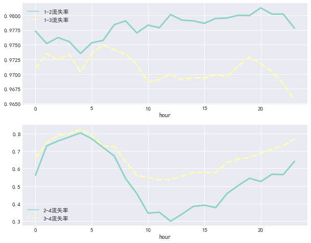


我们能够看到在点击到加购物车和点击到收藏行为间的流失率基本稳定在97.7%左右；在10-15日期间从收藏到支付与从加购物车到支付的流失率较低。

刚开始接触到这类指标，可能得不到多少有效的结论。但不用担心，数据收集和分析持续一段时间后，数据会稳定，你也会适应应用特有的数据分布模式。若是没有这个积累过程，就算面对一个用户严重流失的层次，你也可能完全说不出个所以然。

在获得基线之后，我们可以将数据与基线比较，衡量改动。改进之后，重新收集相关数据。为积累足够访问量，收集过程需要相当时间。获得的数据能清楚地表明改动的效果：若改动后，用户流失比原来小了，那就说明改动成功。相反则需重新考虑设计。

### 消费行为分析

#### 购买频次分析

获取有支付行为的客户信息


```python
dt_buy = dt[dt.behavior_type=="4"]
```


```python
dt_buy.sample(5)
```


<div>
<style scoped>
    .dataframe tbody tr th:only-of-type {
        vertical-align: middle;
    }

    .dataframe tbody tr th {
        vertical-align: top;
    }

    .dataframe thead th {
        text-align: right;
    }
</style>
<table border="1" class="dataframe">
  <thead>
    <tr style="text-align: right;">
      <th></th>
      <th>user_id</th>
      <th>item_id</th>
      <th>behavior_type</th>
      <th>user_geohash</th>
      <th>item_category</th>
      <th>time</th>
      <th>date</th>
      <th>hour</th>
    </tr>
  </thead>
  <tbody>
    <tr>
      <th>2495275</th>
      <td>101601722</td>
      <td>34047414</td>
      <td>4</td>
      <td>NaN</td>
      <td>3628</td>
      <td>2014-11-24 22:00:00</td>
      <td>2014-11-24</td>
      <td>22</td>
    </tr>
    <tr>
      <th>4498818</th>
      <td>121456686</td>
      <td>263967408</td>
      <td>4</td>
      <td>NaN</td>
      <td>9885</td>
      <td>2014-11-30 14:00:00</td>
      <td>2014-11-30</td>
      <td>14</td>
    </tr>
    <tr>
      <th>675580</th>
      <td>114497121</td>
      <td>9517999</td>
      <td>4</td>
      <td>NaN</td>
      <td>5699</td>
      <td>2014-11-19 22:00:00</td>
      <td>2014-11-19</td>
      <td>22</td>
    </tr>
    <tr>
      <th>10087048</th>
      <td>137760555</td>
      <td>152460064</td>
      <td>4</td>
      <td>NaN</td>
      <td>2513</td>
      <td>2014-12-13 15:00:00</td>
      <td>2014-12-13</td>
      <td>15</td>
    </tr>
    <tr>
      <th>1640944</th>
      <td>132039263</td>
      <td>28241579</td>
      <td>4</td>
      <td>NaN</td>
      <td>11406</td>
      <td>2014-11-22 19:00:00</td>
      <td>2014-11-22</td>
      <td>19</td>
    </tr>
  </tbody>
</table>
</div>


获取客户消费次数


```python
# 获取客户消费次数
buy_c = dt_buy.groupby("user_id").size()
```


```python
buy_c.sample(10)
```


    user_id
    20487789     12
    3791755       1
    62871223      1
    61779777      2
    50698254      9
    134118557     6
    110374516    10
    94335711      2
    1344672       1
    48304965      2
    dtype: int64


```python
buy_c.describe()
```


    count    8886.000000
    mean       13.527459
    std        19.698786
    min         1.000000
    25%         4.000000
    50%         8.000000
    75%        17.000000
    max       809.000000
    dtype: float64


从以上统计可以看出，用户平均购买次数为13.5次，标准差19.6，具有一定波动性。中位数是8次，75分位数是17次，说明用户购买次数大部分都在20次以下。而最大值是809次，这差别有点大。
- 一般情况，消费类型的数据分布，大部分呈现的是长尾形态；绝大多数用户是低频次消费客群，但用户贡献率集中在少数分群里，符合二八法则。


```python
plt.hist(x=buy_c,bins=100)
plt.show()
```


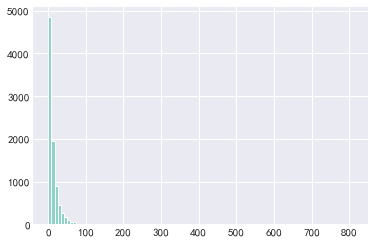


```python
plt.hist(x=buy_c[buy_c.values<=30],bins=10)
```


    (array([2047., 1552., 1248.,  937.,  666.,  491.,  368.,  301.,  222.,
             172.]),
     array([ 1. ,  3.9,  6.8,  9.7, 12.6, 15.5, 18.4, 21.3, 24.2, 27.1, 30. ]),
     <a list of 10 Patch objects>)


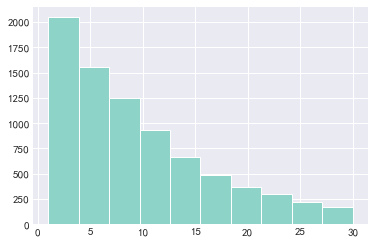


#### 日ARPPU分析

ARPPU（average revenue per paying user）是指从每位付费用户身上获得的收入，即统计周期内，付费用户对产品产生的平均收入

ARPPU = 总收入 / 付费用户数

因数据集中没有消费金额信息，本次采用消费次数代替消费金额


人均消费次数 = 消费总次数 / 消费总人次数


```python
# 人均消费次数 = 消费总次数 / 消费总人次数
dt_arppu = dt[dt.behavior_type == "4"].groupby(
    ["date", "user_id"])["behavior_type"].count().reset_index().rename(
        columns={"behavior_type": "buy_count"})
```


```python
dt_arppu.sample(10)
```


<div>
<style scoped>
    .dataframe tbody tr th:only-of-type {
        vertical-align: middle;
    }

    .dataframe tbody tr th {
        vertical-align: top;
    }

    .dataframe thead th {
        text-align: right;
    }
</style>
<table border="1" class="dataframe">
  <thead>
    <tr style="text-align: right;">
      <th></th>
      <th>date</th>
      <th>user_id</th>
      <th>buy_count</th>
    </tr>
  </thead>
  <tbody>
    <tr>
      <th>23176</th>
      <td>2014-12-03</td>
      <td>3141933</td>
      <td>3</td>
    </tr>
    <tr>
      <th>20672</th>
      <td>2014-12-01</td>
      <td>92780565</td>
      <td>1</td>
    </tr>
    <tr>
      <th>726</th>
      <td>2014-11-18</td>
      <td>31663890</td>
      <td>1</td>
    </tr>
    <tr>
      <th>9891</th>
      <td>2014-11-24</td>
      <td>70891589</td>
      <td>1</td>
    </tr>
    <tr>
      <th>10118</th>
      <td>2014-11-24</td>
      <td>89261071</td>
      <td>1</td>
    </tr>
    <tr>
      <th>46671</th>
      <td>2014-12-17</td>
      <td>22981352</td>
      <td>1</td>
    </tr>
    <tr>
      <th>20587</th>
      <td>2014-12-01</td>
      <td>86323571</td>
      <td>1</td>
    </tr>
    <tr>
      <th>25053</th>
      <td>2014-12-04</td>
      <td>54214799</td>
      <td>1</td>
    </tr>
    <tr>
      <th>15754</th>
      <td>2014-11-28</td>
      <td>61114029</td>
      <td>1</td>
    </tr>
    <tr>
      <th>18632</th>
      <td>2014-11-30</td>
      <td>61754447</td>
      <td>1</td>
    </tr>
  </tbody>
</table>
</div>


```python
dt_arppu.describe()
```


<div>
<style scoped>
    .dataframe tbody tr th:only-of-type {
        vertical-align: middle;
    }

    .dataframe tbody tr th {
        vertical-align: top;
    }

    .dataframe thead th {
        text-align: right;
    }
</style>
<table border="1" class="dataframe">
  <thead>
    <tr style="text-align: right;">
      <th></th>
      <th>buy_count</th>
    </tr>
  </thead>
  <tbody>
    <tr>
      <th>count</th>
      <td>49201.000000</td>
    </tr>
    <tr>
      <th>mean</th>
      <td>2.443141</td>
    </tr>
    <tr>
      <th>std</th>
      <td>3.307288</td>
    </tr>
    <tr>
      <th>min</th>
      <td>1.000000</td>
    </tr>
    <tr>
      <th>25%</th>
      <td>1.000000</td>
    </tr>
    <tr>
      <th>50%</th>
      <td>1.000000</td>
    </tr>
    <tr>
      <th>75%</th>
      <td>3.000000</td>
    </tr>
    <tr>
      <th>max</th>
      <td>185.000000</td>
    </tr>
  </tbody>
</table>
</div>


计算ARPPU


```python
# ARPPU = 每日消费总次数除以消费总人数
ARPPU = pd.DataFrame(
    dt_arppu.groupby("date").sum()["buy_count"] /
    dt_arppu.groupby("date").count()["buy_count"]).rename(
        columns={"buy_count": "ARPPU"})
```


```python
ARPPU.describe()
```


<div>
<style scoped>
    .dataframe tbody tr th:only-of-type {
        vertical-align: middle;
    }

    .dataframe tbody tr th {
        vertical-align: top;
    }

    .dataframe thead th {
        text-align: right;
    }
</style>
<table border="1" class="dataframe">
  <thead>
    <tr style="text-align: right;">
      <th></th>
      <th>ARPPU</th>
    </tr>
  </thead>
  <tbody>
    <tr>
      <th>count</th>
      <td>31.000000</td>
    </tr>
    <tr>
      <th>mean</th>
      <td>2.368446</td>
    </tr>
    <tr>
      <th>std</th>
      <td>0.296108</td>
    </tr>
    <tr>
      <th>min</th>
      <td>2.204384</td>
    </tr>
    <tr>
      <th>25%</th>
      <td>2.262436</td>
    </tr>
    <tr>
      <th>50%</th>
      <td>2.313460</td>
    </tr>
    <tr>
      <th>75%</th>
      <td>2.358159</td>
    </tr>
    <tr>
      <th>max</th>
      <td>3.913523</td>
    </tr>
  </tbody>
</table>
</div>


```python
ARPPU.plot()
```


    <matplotlib.axes._subplots.AxesSubplot at 0x1faa0a64518>


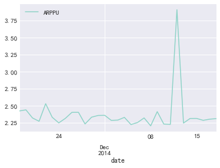


绝大部分消费客户每天消费次数在3次以内，双十二期间达到峰值

#### 日ARPU情况分析

ARPU值 (每用户平均收入,Average Revenue Per User) 就是指每用户平均收入。ARPU注重的是一个时间段内运营商从每个用户所得到的利润。很明显，高端的用户越多，ARPU越高。在这个时间段，从运营商的运营情况来看，ARPU值高说明利润高，这段时间效益好。它可以衡量产品的盈利和发展活力。

ARPU = 消费总收入 / 用户数

因数据集中没有消费金额信息，本次采用消费次数代替消费金额


```python
# 新增一列以便记录各行为次数
dt["behavior_count"] = 1
```


```python
dt.sample(3)
```


<div>
<style scoped>
    .dataframe tbody tr th:only-of-type {
        vertical-align: middle;
    }

    .dataframe tbody tr th {
        vertical-align: top;
    }

    .dataframe thead th {
        text-align: right;
    }
</style>
<table border="1" class="dataframe">
  <thead>
    <tr style="text-align: right;">
      <th></th>
      <th>user_id</th>
      <th>item_id</th>
      <th>behavior_type</th>
      <th>user_geohash</th>
      <th>item_category</th>
      <th>time</th>
      <th>date</th>
      <th>hour</th>
      <th>behavior_count</th>
    </tr>
  </thead>
  <tbody>
    <tr>
      <th>10017159</th>
      <td>117929882</td>
      <td>313405220</td>
      <td>1</td>
      <td>95rilhv</td>
      <td>10392</td>
      <td>2014-12-13 11:00:00</td>
      <td>2014-12-13</td>
      <td>11</td>
      <td>1</td>
    </tr>
    <tr>
      <th>7263735</th>
      <td>111073682</td>
      <td>26727890</td>
      <td>1</td>
      <td>NaN</td>
      <td>13041</td>
      <td>2014-12-07 13:00:00</td>
      <td>2014-12-07</td>
      <td>13</td>
      <td>1</td>
    </tr>
    <tr>
      <th>4786992</th>
      <td>67759870</td>
      <td>179797004</td>
      <td>1</td>
      <td>NaN</td>
      <td>12982</td>
      <td>2014-12-01 07:00:00</td>
      <td>2014-12-01</td>
      <td>7</td>
      <td>1</td>
    </tr>
  </tbody>
</table>
</div>


```python
dt_arpu = dt.groupby(["date", "user_id", "behavior_type"
                      ])["behavior_count"].count().reset_index()
```


```python
dt_arpu.sample(10)
```


<div>
<style scoped>
    .dataframe tbody tr th:only-of-type {
        vertical-align: middle;
    }

    .dataframe tbody tr th {
        vertical-align: top;
    }

    .dataframe thead th {
        text-align: right;
    }
</style>
<table border="1" class="dataframe">
  <thead>
    <tr style="text-align: right;">
      <th></th>
      <th>date</th>
      <th>user_id</th>
      <th>behavior_type</th>
      <th>behavior_count</th>
    </tr>
  </thead>
  <tbody>
    <tr>
      <th>364514</th>
      <td>2014-12-18</td>
      <td>110058496</td>
      <td>1</td>
      <td>161</td>
    </tr>
    <tr>
      <th>300329</th>
      <td>2014-12-12</td>
      <td>87658501</td>
      <td>1</td>
      <td>212</td>
    </tr>
    <tr>
      <th>313130</th>
      <td>2014-12-13</td>
      <td>85994287</td>
      <td>2</td>
      <td>1</td>
    </tr>
    <tr>
      <th>293802</th>
      <td>2014-12-12</td>
      <td>38915660</td>
      <td>1</td>
      <td>87</td>
    </tr>
    <tr>
      <th>224580</th>
      <td>2014-12-07</td>
      <td>123963959</td>
      <td>3</td>
      <td>3</td>
    </tr>
    <tr>
      <th>218121</th>
      <td>2014-12-06</td>
      <td>55305887</td>
      <td>1</td>
      <td>51</td>
    </tr>
    <tr>
      <th>197641</th>
      <td>2014-12-04</td>
      <td>90414084</td>
      <td>2</td>
      <td>4</td>
    </tr>
    <tr>
      <th>44511</th>
      <td>2014-11-21</td>
      <td>85004126</td>
      <td>4</td>
      <td>2</td>
    </tr>
    <tr>
      <th>347688</th>
      <td>2014-12-16</td>
      <td>61068008</td>
      <td>3</td>
      <td>2</td>
    </tr>
    <tr>
      <th>174498</th>
      <td>2014-12-03</td>
      <td>107471039</td>
      <td>1</td>
      <td>143</td>
    </tr>
  </tbody>
</table>
</div>


```python
ARPU = dt_arpu.groupby("date").apply(
    lambda x: x[x.behavior_type == "4"].sum()/len(x.user_id.unique()))
```


```python
ARPU
```


<div>
<style scoped>
    .dataframe tbody tr th:only-of-type {
        vertical-align: middle;
    }

    .dataframe tbody tr th {
        vertical-align: top;
    }

    .dataframe thead th {
        text-align: right;
    }
</style>
<table border="1" class="dataframe">
  <thead>
    <tr style="text-align: right;">
      <th></th>
      <th>behavior_count</th>
    </tr>
    <tr>
      <th>date</th>
      <th></th>
    </tr>
  </thead>
  <tbody>
    <tr>
      <th>2014-11-18</th>
      <td>0.588050</td>
    </tr>
    <tr>
      <th>2014-11-19</th>
      <td>0.574143</td>
    </tr>
    <tr>
      <th>2014-11-20</th>
      <td>0.546660</td>
    </tr>
    <tr>
      <th>2014-11-21</th>
      <td>0.481358</td>
    </tr>
    <tr>
      <th>2014-11-22</th>
      <td>0.577016</td>
    </tr>
    <tr>
      <th>2014-11-23</th>
      <td>0.525184</td>
    </tr>
    <tr>
      <th>2014-11-24</th>
      <td>0.526025</td>
    </tr>
    <tr>
      <th>2014-11-25</th>
      <td>0.545426</td>
    </tr>
    <tr>
      <th>2014-11-26</th>
      <td>0.562058</td>
    </tr>
    <tr>
      <th>2014-11-27</th>
      <td>0.577135</td>
    </tr>
    <tr>
      <th>2014-11-28</th>
      <td>0.519955</td>
    </tr>
    <tr>
      <th>2014-11-29</th>
      <td>0.515906</td>
    </tr>
    <tr>
      <th>2014-11-30</th>
      <td>0.566860</td>
    </tr>
    <tr>
      <th>2014-12-01</th>
      <td>0.597341</td>
    </tr>
    <tr>
      <th>2014-12-02</th>
      <td>0.552824</td>
    </tr>
    <tr>
      <th>2014-12-03</th>
      <td>0.589977</td>
    </tr>
    <tr>
      <th>2014-12-04</th>
      <td>0.565151</td>
    </tr>
    <tr>
      <th>2014-12-05</th>
      <td>0.521282</td>
    </tr>
    <tr>
      <th>2014-12-06</th>
      <td>0.508075</td>
    </tr>
    <tr>
      <th>2014-12-07</th>
      <td>0.507007</td>
    </tr>
    <tr>
      <th>2014-12-08</th>
      <td>0.520871</td>
    </tr>
    <tr>
      <th>2014-12-09</th>
      <td>0.525282</td>
    </tr>
    <tr>
      <th>2014-12-10</th>
      <td>0.483464</td>
    </tr>
    <tr>
      <th>2014-12-11</th>
      <td>0.467943</td>
    </tr>
    <tr>
      <th>2014-12-12</th>
      <td>1.975518</td>
    </tr>
    <tr>
      <th>2014-12-13</th>
      <td>0.513282</td>
    </tr>
    <tr>
      <th>2014-12-14</th>
      <td>0.522346</td>
    </tr>
    <tr>
      <th>2014-12-15</th>
      <td>0.554590</td>
    </tr>
    <tr>
      <th>2014-12-16</th>
      <td>0.560410</td>
    </tr>
    <tr>
      <th>2014-12-17</th>
      <td>0.544182</td>
    </tr>
    <tr>
      <th>2014-12-18</th>
      <td>0.544819</td>
    </tr>
  </tbody>
</table>
</div>


```python
ARPU.describe()
```


<div>
<style scoped>
    .dataframe tbody tr th:only-of-type {
        vertical-align: middle;
    }

    .dataframe tbody tr th {
        vertical-align: top;
    }

    .dataframe thead th {
        text-align: right;
    }
</style>
<table border="1" class="dataframe">
  <thead>
    <tr style="text-align: right;">
      <th></th>
      <th>behavior_count</th>
    </tr>
  </thead>
  <tbody>
    <tr>
      <th>count</th>
      <td>31.000000</td>
    </tr>
    <tr>
      <th>mean</th>
      <td>0.585811</td>
    </tr>
    <tr>
      <th>std</th>
      <td>0.259981</td>
    </tr>
    <tr>
      <th>min</th>
      <td>0.467943</td>
    </tr>
    <tr>
      <th>25%</th>
      <td>0.520413</td>
    </tr>
    <tr>
      <th>50%</th>
      <td>0.544819</td>
    </tr>
    <tr>
      <th>75%</th>
      <td>0.566005</td>
    </tr>
    <tr>
      <th>max</th>
      <td>1.975518</td>
    </tr>
  </tbody>
</table>
</div>


```python
ARPU.plot()
```


    <matplotlib.axes._subplots.AxesSubplot at 0x1fa9ea20da0>


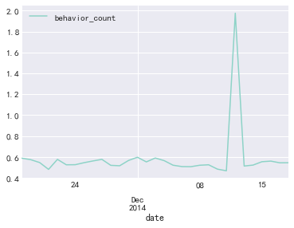


淘宝app活跃用户（有过操作行为的用户）在2014-11-18至2014-12-18这31天内，每天消费次数在0.5次上下波动，而在双十二期间到达峰值1，976，即平均每人双十二消费2次

#### 付费率

付费率 = 消费人数 / 总用户数

从此份数据中我们不嫩得到淘宝总用户数，故使用活跃用户总数代替总用户数


```python
# 从此份数据中我们不嫩得到淘宝总用户数，故使用活跃用户总数代替总用户数
rate_pay = dt_arpu.groupby("date").apply(lambda x: x[
    x.behavior_type == "4"].count() / len(x.user_id.unique())).iloc[:, 1]
```


```python
rate_pay.plot()
```


    <matplotlib.axes._subplots.AxesSubplot at 0x1fa9f2a90b8>


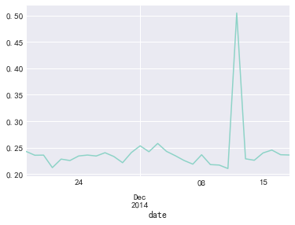


```python
rate_pay.describe()
```


    count    31.000000
    mean      0.241566
    std       0.050087
    min       0.210183
    25%       0.225660
    50%       0.235358
    75%       0.240304
    max       0.504793
    Name: user_id, dtype: float64


在每天活跃用户群中，具有消费行为的占24%左右，双十二到达50%

#### 同一时间段用户消费次数分布


```python
pay_f = dt[dt.behavior_type=="4"].groupby(["user_id","date","hour"])["behavior_count"].sum()
```


```python
sns.distplot(pay_f)
```


    <matplotlib.axes._subplots.AxesSubplot at 0x1fa9d526588>


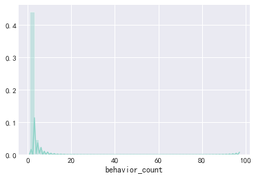


```python
pay_f.describe()
```


    count    65223.000000
    mean         1.842985
    std          2.295531
    min          1.000000
    25%          1.000000
    50%          1.000000
    75%          2.000000
    max         97.000000
    Name: behavior_count, dtype: float64


```python
pay_f.mode()
```


    0    1
    dtype: int64


在同一小时段中，用户消费次数最多的为一次，75分位数为2次

#### 复购情况分析
复购情况：存在两天及以上有购买行为，一天多次购买算作一次

复购率 = 又复购行为的用户数 / 有购买行为的用户数

##### 复购率

每个用户在不同日期购买总次数


```python
# 每个用户在不同日期购买总次数
dt_rebuy = dt[dt.behavior_type == "4"].groupby('user_id')["date"].apply(
    lambda x: len(x.unique())).rename("rebuy_count")
```


```python
dt_rebuy.sample(5)
```


    user_id
    107209058    22
    112806422     5
    61966309     18
    13103318     13
    95839581      7
    Name: rebuy_count, dtype: int64


```python
print("复购率为：%.3f"%(dt_rebuy[dt_rebuy>=2].count()/dt_rebuy.count()))
```

    复购率为：0.872
    

##### 复购时间分析

计算不同时间，不同用户的购买次数


```python
# 计算不同时间(天），不同用户的购买次数
dt_buy_d = dt[dt.behavior_type == "4"].groupby(
    ["user_id", "date"])["behavior_count"].count().reset_index()
```


```python
dt_buy_d.sample(10)
```


<div>
<style scoped>
    .dataframe tbody tr th:only-of-type {
        vertical-align: middle;
    }

    .dataframe tbody tr th {
        vertical-align: top;
    }

    .dataframe thead th {
        text-align: right;
    }
</style>
<table border="1" class="dataframe">
  <thead>
    <tr style="text-align: right;">
      <th></th>
      <th>user_id</th>
      <th>date</th>
      <th>behavior_count</th>
    </tr>
  </thead>
  <tbody>
    <tr>
      <th>39965</th>
      <td>76314785</td>
      <td>2014-11-20</td>
      <td>1</td>
    </tr>
    <tr>
      <th>20195</th>
      <td>23376907</td>
      <td>2014-11-20</td>
      <td>1</td>
    </tr>
    <tr>
      <th>12578</th>
      <td>131701813</td>
      <td>2014-12-15</td>
      <td>1</td>
    </tr>
    <tr>
      <th>12840</th>
      <td>132231447</td>
      <td>2014-12-15</td>
      <td>2</td>
    </tr>
    <tr>
      <th>8693</th>
      <td>121756245</td>
      <td>2014-12-05</td>
      <td>1</td>
    </tr>
    <tr>
      <th>46422</th>
      <td>93127487</td>
      <td>2014-11-19</td>
      <td>2</td>
    </tr>
    <tr>
      <th>32495</th>
      <td>56592437</td>
      <td>2014-11-19</td>
      <td>1</td>
    </tr>
    <tr>
      <th>5923</th>
      <td>114971408</td>
      <td>2014-11-28</td>
      <td>2</td>
    </tr>
    <tr>
      <th>45646</th>
      <td>91087067</td>
      <td>2014-12-17</td>
      <td>1</td>
    </tr>
    <tr>
      <th>27333</th>
      <td>42208524</td>
      <td>2014-12-13</td>
      <td>1</td>
    </tr>
  </tbody>
</table>
</div>


不同用户购物时间间隔


```python
# 不同用户购物时间间隔
dt_buy_d["d_diff"] = dt_buy_d.groupby("user_id").date.apply(
    lambda x: x.sort_values().diff(1)).map(lambda x:x.days)
```


```python
dt_buy_d.describe()
```


<div>
<style scoped>
    .dataframe tbody tr th:only-of-type {
        vertical-align: middle;
    }

    .dataframe tbody tr th {
        vertical-align: top;
    }

    .dataframe thead th {
        text-align: right;
    }
</style>
<table border="1" class="dataframe">
  <thead>
    <tr style="text-align: right;">
      <th></th>
      <th>behavior_count</th>
      <th>d_diff</th>
    </tr>
  </thead>
  <tbody>
    <tr>
      <th>count</th>
      <td>49201.000000</td>
      <td>40315.000000</td>
    </tr>
    <tr>
      <th>mean</th>
      <td>2.443141</td>
      <td>3.732333</td>
    </tr>
    <tr>
      <th>std</th>
      <td>3.307288</td>
      <td>3.858599</td>
    </tr>
    <tr>
      <th>min</th>
      <td>1.000000</td>
      <td>1.000000</td>
    </tr>
    <tr>
      <th>25%</th>
      <td>1.000000</td>
      <td>1.000000</td>
    </tr>
    <tr>
      <th>50%</th>
      <td>1.000000</td>
      <td>2.000000</td>
    </tr>
    <tr>
      <th>75%</th>
      <td>3.000000</td>
      <td>5.000000</td>
    </tr>
    <tr>
      <th>max</th>
      <td>185.000000</td>
      <td>30.000000</td>
    </tr>
  </tbody>
</table>
</div>


```python
# 绘图
dt_buy_d.iloc[:,-1].dropna().value_counts().plot(kind="bar")
plt.xlabel("day_diff")
plt.ylabel("count")
```


    Text(0, 0.5, 'count')


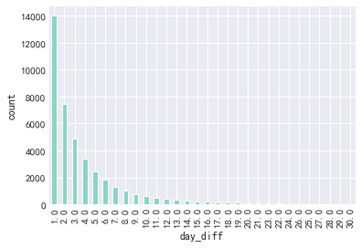


不同用户平均复购时间


```python
# 不同用户平均复购时间
sns.distplot(dt_buy_d.groupby("user_id").d_diff.mean().dropna())
```


    <matplotlib.axes._subplots.AxesSubplot at 0x1fae9d95c88>


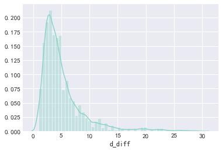


计算分位数


```python
dt_buy_d.quantile(np.linspace(0,1,11)).iloc[:,1]
```


    0.0     1.0
    0.1     1.0
    0.2     1.0
    0.3     1.0
    0.4     2.0
    0.5     2.0
    0.6     3.0
    0.7     4.0
    0.8     6.0
    0.9     9.0
    1.0    30.0
    Name: d_diff, dtype: float64


80%的淘宝用户复购复购时间在6天以内

### 漏斗流失分析


```python
dt_c = dt.groupby("behavior_type").size()
```


```python
dt_c
```


    behavior_type
    1    11550581
    2      242556
    3      343564
    4      120205
    dtype: int64


```python
print("从点击到收藏流失率为%.3f" % ((dt_c[0] - dt_c[1]) * 100 / dt_c[0]))
```

    从点击到收藏流失率为97.900
    


```python
print("从点击到加购物车流失率为%.3f" % ((dt_c[0] - dt_c[2]) * 100 / dt_c[0]))
```

    从点击到加购物车流失率为97.026
    


```python
print("从加购物车到支付流失率为%.3f" % ((dt_c[2] - dt_c[3]) * 100 / dt_c[2]))
```

    从加购物车到支付流失率为65.012
    


```python
print("从加收藏到支付流失率为%.3f" % ((dt_c[1] - dt_c[3]) * 100 / dt_c[2]))
```

    从加收藏到支付流失率为35.612
    

### 用户价值RFM模型分析

因数据集中无消费金额相关信息，因此此处仅对R、F两方面进行用户价值分析

每位用户最近的购买时间


```python
# 参考时间
from datetime import datetime
datenow = datetime(2014, 12, 19)
```


```python
# 每位用户最近的购买时间
recently_pay_time =  dt[dt.behavior_type == "4"].groupby("user_id").date.apply(
    lambda x: datenow - x.sort_values().iloc[-1])
```


```python
recently_pay_time = recently_pay_time.rename("recent")
```


```python
recently_pay_time = recently_pay_time.reset_index()
```


```python
recently_pay_time.recent = recently_pay_time.recent.map(lambda x: x.days)
```


```python
recently_pay_time.head(5)
```


<div>
<style scoped>
    .dataframe tbody tr th:only-of-type {
        vertical-align: middle;
    }

    .dataframe tbody tr th {
        vertical-align: top;
    }

    .dataframe thead th {
        text-align: right;
    }
</style>
<table border="1" class="dataframe">
  <thead>
    <tr style="text-align: right;">
      <th></th>
      <th>user_id</th>
      <th>recent</th>
    </tr>
  </thead>
  <tbody>
    <tr>
      <th>0</th>
      <td>100001878</td>
      <td>1</td>
    </tr>
    <tr>
      <th>1</th>
      <td>100011562</td>
      <td>3</td>
    </tr>
    <tr>
      <th>2</th>
      <td>100012968</td>
      <td>1</td>
    </tr>
    <tr>
      <th>3</th>
      <td>100014060</td>
      <td>1</td>
    </tr>
    <tr>
      <th>4</th>
      <td>100024529</td>
      <td>3</td>
    </tr>
  </tbody>
</table>
</div>


每位用户消费频率


```python
# 每位用户消费频率
buy_freq = dt[dt.behavior_type == "4"].groupby("user_id").date.count().rename(
    "freq").reset_index()
```


```python
buy_freq.head()
```


<div>
<style scoped>
    .dataframe tbody tr th:only-of-type {
        vertical-align: middle;
    }

    .dataframe tbody tr th {
        vertical-align: top;
    }

    .dataframe thead th {
        text-align: right;
    }
</style>
<table border="1" class="dataframe">
  <thead>
    <tr style="text-align: right;">
      <th></th>
      <th>user_id</th>
      <th>freq</th>
    </tr>
  </thead>
  <tbody>
    <tr>
      <th>0</th>
      <td>100001878</td>
      <td>36</td>
    </tr>
    <tr>
      <th>1</th>
      <td>100011562</td>
      <td>3</td>
    </tr>
    <tr>
      <th>2</th>
      <td>100012968</td>
      <td>15</td>
    </tr>
    <tr>
      <th>3</th>
      <td>100014060</td>
      <td>24</td>
    </tr>
    <tr>
      <th>4</th>
      <td>100024529</td>
      <td>26</td>
    </tr>
  </tbody>
</table>
</div>


因为只有31天的数据，所以这儿只基于等频分段，简单的将R、F分为两个等级


```python
# 因为只有31天的数据，所以这儿只基于等频分段，简单的将R、F分为两个等级(分数越高越好)
RFM = pd.merge(recently_pay_time,buy_freq,on="user_id",how="outer")
RFM["R_value"] = pd.qcut(RFM["recent"],2,labels=["2","1"])
RFM["F_value"] = pd.qcut(RFM["freq"],2,labels=["1","2"])
RFM["RFM"] = RFM["R_value"].str.cat(RFM["F_value"])
```


```python
RFM.head()
```


<div>
<style scoped>
    .dataframe tbody tr th:only-of-type {
        vertical-align: middle;
    }

    .dataframe tbody tr th {
        vertical-align: top;
    }

    .dataframe thead th {
        text-align: right;
    }
</style>
<table border="1" class="dataframe">
  <thead>
    <tr style="text-align: right;">
      <th></th>
      <th>user_id</th>
      <th>recent</th>
      <th>freq</th>
      <th>R_value</th>
      <th>F_value</th>
      <th>RFM</th>
    </tr>
  </thead>
  <tbody>
    <tr>
      <th>0</th>
      <td>100001878</td>
      <td>1</td>
      <td>36</td>
      <td>2</td>
      <td>2</td>
      <td>22</td>
    </tr>
    <tr>
      <th>1</th>
      <td>100011562</td>
      <td>3</td>
      <td>3</td>
      <td>2</td>
      <td>1</td>
      <td>21</td>
    </tr>
    <tr>
      <th>2</th>
      <td>100012968</td>
      <td>1</td>
      <td>15</td>
      <td>2</td>
      <td>2</td>
      <td>22</td>
    </tr>
    <tr>
      <th>3</th>
      <td>100014060</td>
      <td>1</td>
      <td>24</td>
      <td>2</td>
      <td>2</td>
      <td>22</td>
    </tr>
    <tr>
      <th>4</th>
      <td>100024529</td>
      <td>3</td>
      <td>26</td>
      <td>2</td>
      <td>2</td>
      <td>22</td>
    </tr>
  </tbody>
</table>
</div>


通过RFM对用户进行分组后，可对不同组别的客户拟制实施不同的营销方式

## 总结

### pv、uv分析得知：

#### 日访问
- 访问量与访问用户间，表现为强相关性
- 双十二期间，pv与uv同时到达峰值
#### 小时访问
- PV与UV呈相同的变化趋势，0-5点呈下降趋势，5-10逐渐增长，21时附近达到峰值，18点-0点为淘宝app用户活跃时间段
#### 不同行为类型用户PV分析
我们能够看到在点击到加购物车和点击到收藏行为间的流失率基本稳定在97.7%左右；在10-15日期间从收藏到支付与从加购物车到支付的流失率较低。

### 消费行为分析
- 用户平均购买次数为13.5次，标准差19.6，具有一定波动性。中位数是8次，75分位数是17次，说明用户购买次数大部分都在20次以下。而最大值是809次，这差别有点大。
- 一般情况，消费类型的数据分布，大部分呈现的是长尾形态；绝大多数用户是低频次消费客群，但用户贡献率集中在少数分群里，符合二八法则。
#### ARPPU分析：
- 绝大部分消费客户每天消费次数在3次以内，双十二期间达到峰值
#### 日ARPU情况分析
- 淘宝app活跃用户（有过操作行为的用户）在2014-11-18至2014-12-18这31天内，每天消费次数在0.5次上下波动，而在双十二期间到达峰值1，976，即平均每人双十二消费2次
### 付费情况
- 在每天活跃用户群中，具有消费行为的占24%左右，双十二到达50%
- 在同一小时段中，用户消费次数最多的为一次，75分位数为2次
### 复购情况
- 80%的淘宝用户复购复购时间在6天以内
- 复购率为：0.872
### 漏斗流失分析
- 从点击到收藏流失率为97.900
- 从点击到加购物车流失率为97.026
- 从加购物车到支付流失率为65.012
- 从加收藏到支付流失率为35.612
### RFM
- 我们通过RFM将用户分为了多组，可对不同组别的客户拟制实施不同的营销方式


```python

```
